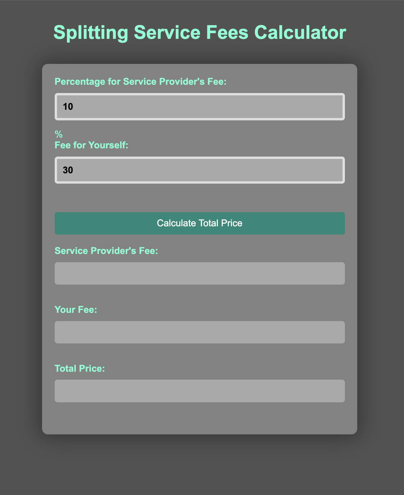

# Splitting Service Fee Calculator

A web app to calculate the exact provider fee based on the percentage due to the service host. It's intended to help users split the service fees fairly based on the agreed percentage.

## Usage

1. Open the `index.html` file in a web browser.
2. Enter the percentage for the service provider's fee and the fee for yourself.
3. Click the "Calculate Total Price" button to see the results.

## Technologies Used

- HTML
- CSS
- JavaScript

## How it Works

This program uses JavaScript to calculate the total price of a service, the fee for a service provider, and the fee for yourself. The calculations are based on the percentage for the service provider's fee and the fee for yourself that you enter into the form. Once you click the "Calculate Total Price" button, the program outputs the results to the form.

## Screenshots

        Case example:

        To calculate the total price of the service and split it 90% for you and 10% for the service provider while ensuring that your fee is exactly £30, you can follow these steps:

        Let's assume that the total price of the service is x.
        Your fee is 90% of x, or 0.9x.
        The service provider's fee is 10% of x, or 0.1x.
        You want your fee to be exactly £30, so we can set up the following equation:
        0.9x = £30
        To solve for x, divide both sides of the equation by 0.9:
        x = £30 / 0.9
        x = £33.33 (rounded to two decimal places)
        Now that we know the total price of the service is £33.33, we can calculate your fee and the service provider's fee:
        Your fee: 90% of £33.33 = £29.99 (rounded to two decimal places)
        Service provider's fee: 10% of £33.33 = £3.33 (rounded to two decimal places)
        Therefore, to split the price of the service 90% for you and 10% for the service provider while ensuring that your fee is exactly £30, the total price of the service should be £33.33, your fee should be £29.99, and the service provider's fee should be £3.33.

## Acknowledgements

This program was created by Matteo Galesi as a personal project for calculating service fees.
